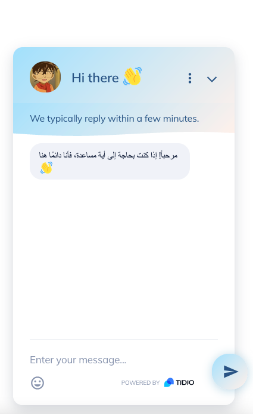

## The simplistic way to add a (FREE) chatbot in your application using `Tidio` in a minute

1. Register on https://www.tidio.com/ & complete the setup.

2. Copy the code snippet and paste it in your web application like [our sample code](./index.html).

3. Customize what you want in the Tidio dashboard like upgrading the free tier & changing chatbot language.

4. And that's it! [view our live example NOW!](tidio-app.github.io).

